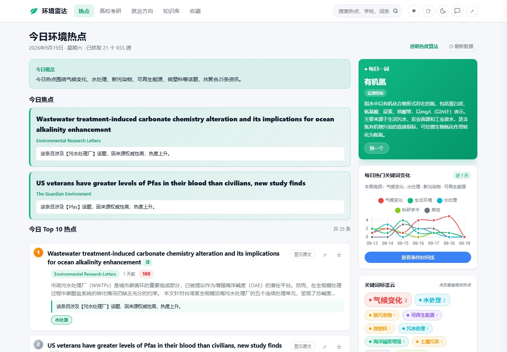
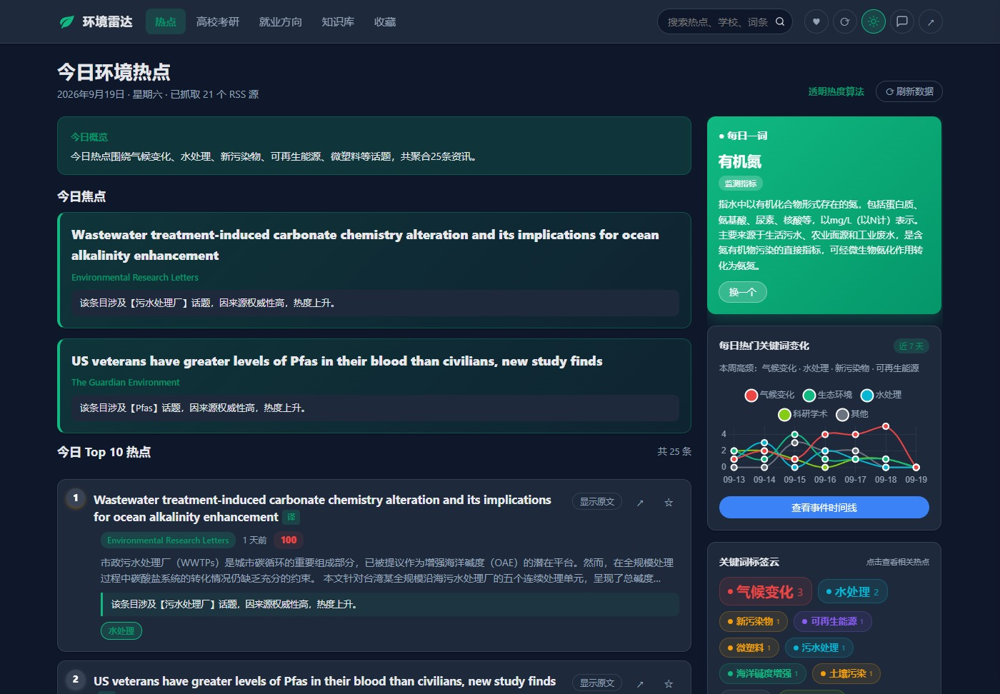
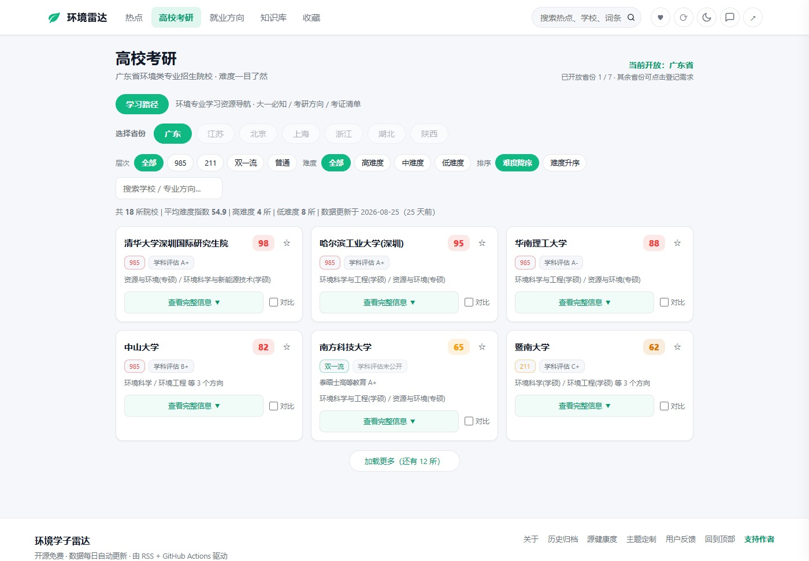
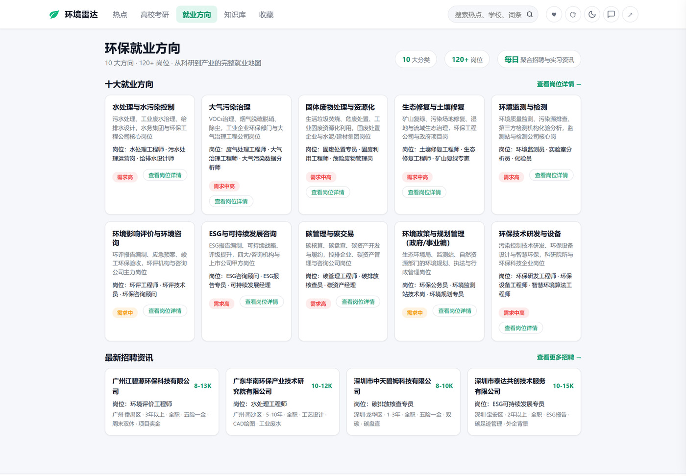
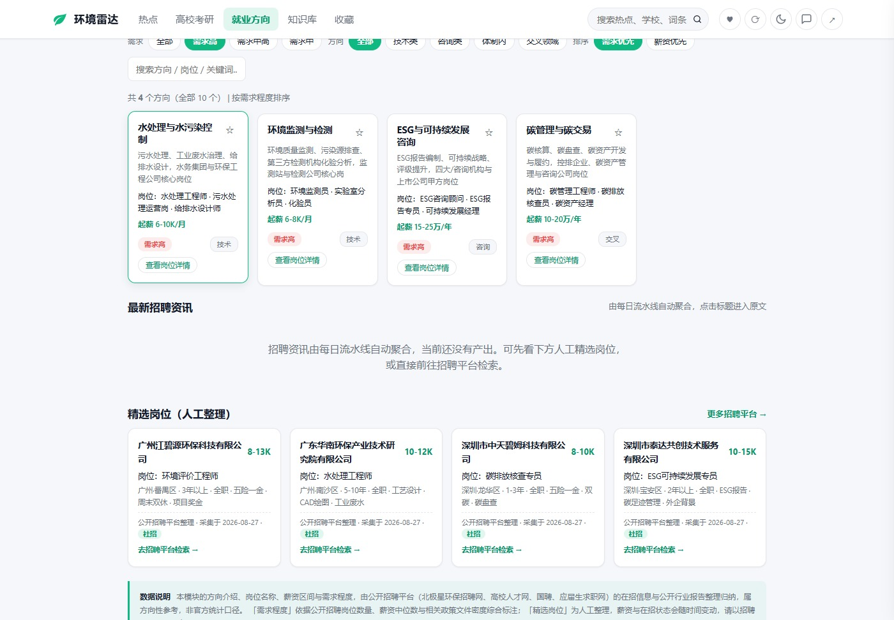
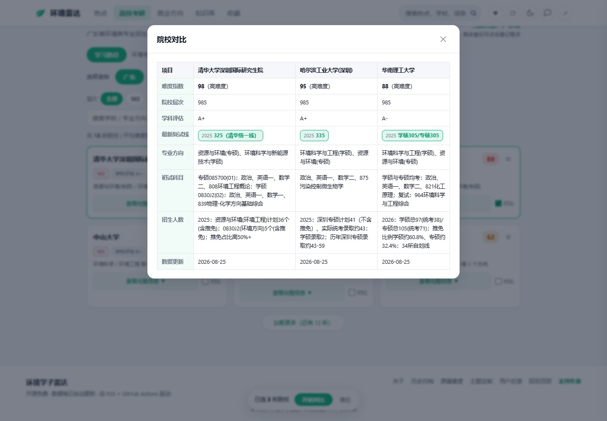
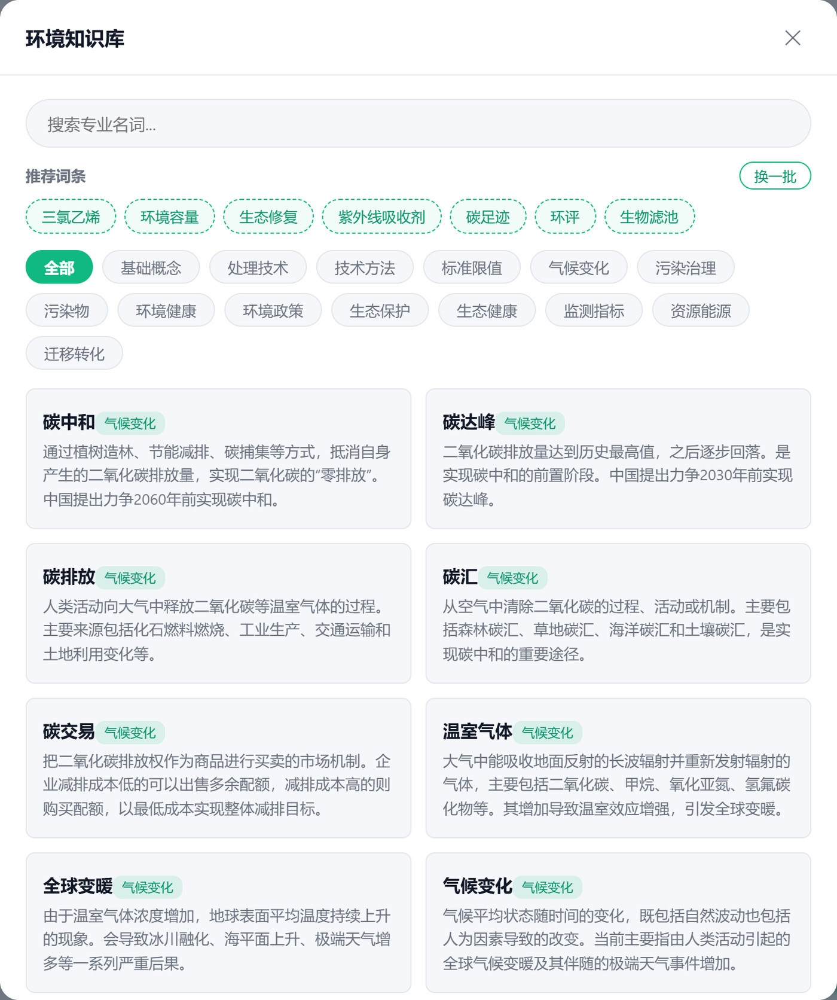
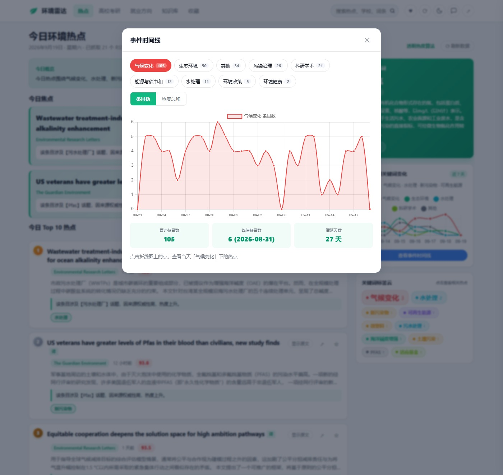
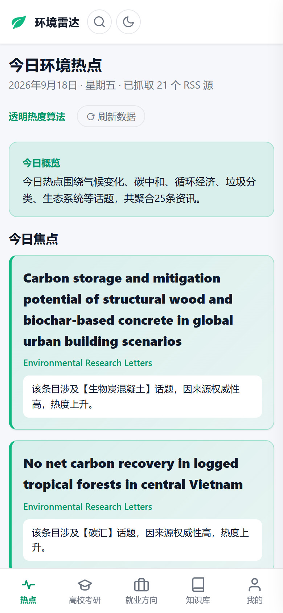

# 环境学子雷达

> 面向环境专业学生的开源热点聚合平台 —— 每日自动聚合 28 个权威信息源，用透明的热度算法为你筛选最值得关注的环境领域资讯。

[](https://opensource.org/licenses/MIT)
[](https://black15647.github.io/hotspot-radar/)

**在线访问**：<https://black15647.github.io/hotspot-radar/>

---

## 功能特性

### 内容与算法

- **每日热点榜单**：自动聚合 Google News、The Guardian、Yale Environment 360、BBC、Nature、Water Research、ScienceDaily 等 28 个信息源，其中包含 5 个中文环境垂直源（中国环境网、生态环境部、北极星环保网、中国水网、人民网环保频道）
- **透明热度算法 v3.0**：权威度 + 话题分 + 事件共振 + 信息量四维可解释评分，经时间衰减、信息密度与重复惩罚修正后，按绝对标定映射到 40-100（可跨日比较；同时保留 v1 分数用于对比）。点击热度徽章可逐项展开每个维度的推导过程，明细含四个维度得分、乘性系数、事件簇规模与原始分
- **AI 参与算法（语义事件聚类）**：把标题列表交给 AI 做语义事件分组，输出供热度算法的「事件共振」维度使用（同一事件被几家不同原始媒体报道）。AI 未启用／熔断／超预算／解析失败时自动回退到标题 token 重叠聚类，算法输出与完全没有 AI 时逐字节一致
- **智能分析与「为什么是热点」**：每条热点自动生成一句话分析，说明热度驱动因素（v3.0 与 v1 两套明细键名都兼容）；关注建议由后端下发、与算法同源的**热度分级**（高／中／低）给出；也可对单条一键生成自然语言解释
- **关键词标签云与近 7 天热词统计**：直观展示当日热门环境专业概念；从每日快照中统计实际高频词，趋势图联动展示
- **历史趋势与时间线**：近 7 天资讯数量趋势、任意关键词 365 天热度追踪，以及可切换 7/14/30 天的热点时间线（按大类展示每日热度变化）
- **历史归档**：按年月浏览历史热点，可回溯任意日期的 Top10 榜单
- **今日焦点模块**：醒目展示当天最重要的 1-2 条热点
- **环境知识库**：内置 384 条环境专业术语解释，按 14 个分类组织（污染物 / 环境政策 / 监测指标 / 处理技术 / 标准限值等）；支持按词条名、释义、分类三字段检索（命中片段高亮）、分类筛选（按钮上直接标出条数）、推荐词条、「热门」视图（按近 30 天热点出现次数排序）与「复习」星标清单（localStorage 持久化）；列表分批渲染（每批 60 条 + 加载更多），长释义默认折叠、可展开全文；点词条名打开释义弹窗，可直接复制、查看该词的热度趋势与关联热点
- **自动提取新词**：使用 jieba 分词从每日热点中提取候选新词，生成 `pending_terms.json` 供知识库维护
- **热点详情展开**：点击标题展开完整摘要和分析，支持「阅读原文」和「代理访问」（Google 翻译代理）
- **个性化过滤**：支持自定义用户关键词，生成专属热点列表
- **我的收藏**：热点、考研院校、就业方向三类都可收藏，收藏弹窗按「热点 / 考研院校 / 就业方向」分区展示并给出各类计数；支持按热度或收藏时间排序、导出为 JSON（便于换设备迁移）、一键清空；取消收藏入口常驻在每条信息行上，不必先展开详情；数据只保存在本地浏览器

### AI 能力

- **AI 智能摘要**：基于英伟达 NIM (nvidia/nemotron-3.5-lightning-30b-a3b) 批量生成热点摘要；原文提取升级为 trafilatura 本地提取 + readability 兜底 + Firecrawl keyless 兜底 + Jina Reader 兜底，提高原文获取成功率；有原文基于原文生成，无原文基于标题生成，保证每条热点都有摘要
- **英文内容翻译**：内置环境专业英中词表 + **DeepL Free API（可选）** + **Google 翻译兜底**；英文热点自动生成中文标题 `title_zh` 字段，前端提供「译」按钮在英文/中文标题间切换
- **近 7 天热度总结**：基于实际高频词 AI 生成总结，失败自动降级为规则总结
- **AI 调用治理（防 429）**：所有 AI 请求经同一出口，统一过四道闸门 —— ①频率控制（滑动窗口 + 最小间隔，默认 30 rpm）②并发限制（信号量）③失败重试与退避（429/5xx/超时按退避表重试，采信服务端 `Retry-After`，叠加单向抖动）④结果缓存（内容寻址，命中直接跳过网络请求）；另有单次运行调用预算与按功能独立熔断，运行结束打印调用汇总。机制与默认值详见下文「AI 能力与算法流程集成」

### 两个数据窗口

- **高校考研窗口**：双窗口结构，独立的高校考研院校分析模块，内置广东省 18 所高校环境类考研详细数据；支持按层次、难度筛选，按难度排序，支持按校名／专业方向／学科／标签检索；院校卡片可收藏，可勾选 2~4 所并排对比难度指数、学科评估、复试线、招生人数；展开查看完整考试科目、参考书目、复试内容、历年复试线（按年份结构化并列，最近一年高亮）、招生人数；统计条如实标注数据更新时间，超过 90 天给出「待更新」提示；支持 7 个省份选择（广东已开放，其余省份点击可登记需求）
- **就业方向窗口**：展示环境专业十大就业方向（水处理、大气治理、固废、生态修复、环境监测、环评咨询、ESG、碳管理、环境政策、环保研发），共 30 个典型岗位（页头统计由数据动态计算）；每张卡片含方向简介、典型岗位、薪资区间、需求程度与方向属性标签，以及按需展开的详细描述；支持按需求程度、方向属性筛选与关键词搜索。招聘部分分两块：**最新招聘资讯**由每日 RSS 流水线自动聚合（含来源、发布日期与原文链接），**精选岗位**为人工整理的真实企业岗位（含来源、采集日期与检索入口）；页面底部附数据来源与需求程度判定口径说明

### 界面与体验

- **主题定制**：主色、背景色、文字颜色、字体、圆角、密度、字号自由调节，实时预览并保存到 localStorage；一键切换暗黑模式
- **移动端适配**：移动端固定底部 Tab 栏，快速切换热点、高校考研、就业方向、知识库与我的（收藏），与顶部导航一一对应
- **微交互与加载体验**：按钮缩放、卡片悬停、模态框淡入淡出、收藏弹跳等动画（尊重系统 `prefers-reduced-motion`，自动禁用大部分动画）；数据加载期间显示骨架屏占位；滚动超过 300px 显示回到顶部按钮
- **分享**：支持系统分享面板或复制链接，一键分享给同学

### 数据与运维

- **RSS 源健康度**：实时监控每个 RSS 源的抓取状态，连续失败自动标记并邮件通知
- **个人知识库自动记录**：每日热点自动追加到 `personal_knowledge.md`，积累个人学习笔记；主文件只保留最近 180 天，更早的按月份轮转到 `docs/data/archive/personal_knowledge-YYYY-MM.md`（先归档成功才裁剪，归档失败则原样保留）
- **SEO 优化**：完整的 title / description / keywords / author / robots meta，Open Graph（含 `og:image`、`og:site_name`、`og:locale`）与 Twitter Card，canonical 链接与 sitemap.xml（`lastmod` 由 CI 每日刷新），提升搜索引擎收录与社交平台分享表现
- **用户反馈**：通过 GitHub Issues 提交反馈，无需后端服务器
- **邮件推送**：每日报告自动发送至站长个人邮箱（可选）
- **自动备份与失败通知**：每日把关键数据打包上传到 GitHub Release，工作流失败时通过 ntfy.sh 推送通知
- **合规说明**：明确项目使用范围、数据来源、爬虫规范、隐私保护等合规声明
- **GitHub Pages 部署**：纯静态站点 + GitHub Actions 自动更新，零成本运行
- **赞赏支持**：集成爱发电按钮，支持作者持续维护

---

## 快速开始（5 分钟部署到 GitHub Pages）

### 第一步：Fork 本仓库

点击右上角的 **Fork** 按钮，将项目复制到你的 GitHub 账号下。

### 第二步：启用 GitHub Pages

1. 进入你 Fork 的仓库 → **Settings** → **Pages**
2. 在 **Build and deployment** 中，Source 选择 **Deploy from a branch**
3. Branch 选择 **main**，文件夹选择 **/docs**，点击 **Save**
4. 等待几分钟，你的站点将在 `https://<你的用户名>.github.io/hotspot-radar/` 上线

### 第三步：触发首次数据生成

1. 进入仓库的 **Actions** 标签页
2. 找到 **Daily Hotspot Report** 工作流
3. 点击 **Run workflow** 手动触发一次，生成初始数据

完成！你的环境学子雷达已经上线

---

## 配置说明

### `config.yaml` 详细说明

项目根目录下的 `config.yaml` 是唯一需要修改的配置文件。

#### 最小配置模板

```yaml
# 只需填写 rss_feeds 即可运行，其余字段均有默认值
site_name: "环境学子雷达"

rss_feeds:
  "Google News 环境保护": "https://news.google.com/rss/search?q=环境保护&hl=zh-CN&gl=CN&ceid=CN:zh-Hans"
  # ... 更多源
```

#### 可选字段

| 字段 | 类型 | 默认值 | 说明 |
|------|------|--------|------|
| `site_name` | string | "环境学子雷达" | 站点名称 |
| `keywords` | list | 内置 58 个环境关键词 | 用于热度计算和标签云的关键词列表；热度算法的话题分直接依赖它，改词表要同时改 `daily_report.py` 与 `config.yaml` 的注释块 |
| `user_keywords` | list | 空 | 用户个性化关键词，填写后生成 `personal_latest.json` |
| `weights.source_weights` | dict | 见 `config.yaml`（28 个源分 5 档：顶刊 2.0 / 专业环境媒体与官方机构 1.5 / 精准主题查询 1.4 / 学术机构与垂直源 1.3 / 宽泛聚合查询 1.2） | 各来源的权重，未列出的源回退 1.0；直接决定 v3.0 的权威度维度 |
| `weights.time_decay` | float | 0.8 | **当前没有任何代码读取它**（v1 的时间衰减是固定式子 `10 × e^(−hours/24)`，v3.0 用的是固定曲线，都不读这个键）；保留只为兼容旧配置文件，改它不会改变排序 |
| `weights.keyword_bonus` | float | 2.0 | **仅 v1 旧算法读取**；v3.0 的话题分改用 IDF 饱和公式，不再用固定加分 |
| `email_config.smtp_server` | string | 空 | SMTP 服务器地址（如 smtp.qq.com） |
| `email_config.smtp_port` | int | 465 | SMTP 端口 |
| `email_config.sender` | string | 空 | 发件人邮箱 |
| `email_config.password` | string | 空 | 发件人授权码 |
| `email_config.receiver` | string | 空 | 收件人邮箱（站长个人），为空则不发送 |
| `summary_api.enabled` | bool | false | 是否启用 AI 摘要生成和关键词提取 |
| `summary_api.api_key` | string | 空 | 英伟达 NIM API Key（也可通过环境变量 NVIDIA_API_KEY 设置，在 https://build.nvidia.com 注册获取） |
| `summary_api.model` | string | nvidia/nemotron-3.5-lightning-30b-a3b | 英伟达 NIM 模型名称 |
| `summary_api.base_url` | string | https://integrate.api.nvidia.com/v1/ | API 基础地址 |
| `summary_api.max_tokens` | int | 150 | 生成摘要的最大 token 数 |
| `summary_api.limits` | 映射 | 见下方「AI 能力与算法流程集成」 | AI 调用治理（防 429）：`rpm` / `max_concurrency` / `max_calls_per_run` / 退避抖动 / 缓存开关，缺键时用代码内默认值 |
| `summary_api.algorithm_ai` | 映射 | 见下方 | AI 参与算法流程：`semantic_event_clustering`（语义事件聚类开关）/ `max_items` |
| `reader_api.enabled` | bool | true | 是否启用原文提取 |
| `reader_api.local_extraction` | bool | true | 是否使用 readability-lxml + html2text 本地提取 |
| `reader_api.firecrawl_enabled` | bool | true | 是否启用 Firecrawl keyless 兜底（无需 API Key） |
| `reader_api.jina_api_key` | string | 空 | Jina Reader API Key（也可通过环境变量 JINA_API_KEY 设置） |
| `reader_api.jina_base_url` | string | https://r.jina.ai/ | Jina Reader 基础地址 |
| `translation_api.enabled` | bool | true | 是否启用英文翻译（标题/摘要） |
| `translation_api.provider` | string | auto | `deepl`（仅 DeepL）/ `google`（仅 Google）/ `auto`（有 Key 优先 DeepL，失败自动切 Google） |
| `translation_api.deepl_api_key` | string | 空 | DeepL Free API Key（https://www.deepl.com/pro-api 注册获取）；留空则自动使用 Google 免费翻译接口 |
| `max_items_per_source` | int | 5 | 每个源最大抓取条数（冷启动自动设为 10） |
| `max_total_items` | int | 50 | 总条目上限 |
| `hotness.*` | 映射 | 见「热度算法说明」 | v3.0 算法参数：`dimensions`（四维满分）/ `topic`（IDF、聚集度、兜底上限）/ `resonance.tau` / `event_cluster`（重叠系数阈值、重复惩罚）/ `display`（标定模式与常数），缺键时用代码内默认值 |
| `content_density.*` | 映射 | `boilerplate_penalty: 0.65` / `thin_penalty: 0.85` / `policy_bonus: 1.10` / `max_boilerplate: -1` | 信息密度系数与「地方政务通稿」每日配额；`max_boilerplate` 默认 `-1` 表示只降权不删 |

#### 添加自定义 RSS 源

在 `rss_feeds` 中添加一行即可：

```yaml
rss_feeds:
  "我的自定义源": "https://example.com/rss.xml"
```

#### 维护环境知识库

项目内置 384 条环境专业术语，存储在 `docs/data/glossary.json` 中，格式为 `{"term": "xxx", "definition": "xxx", "category": "xxx"}`。前端对 `term` / `definition` / `category` 三个字段做检索，分类按钮由数据中的 `category` 去重生成，新增分类不需要改前端代码。

**自动提取新词**：脚本每日运行时会使用 jieba 分词从热点标题中提取候选新词，生成 `docs/data/pending_terms.json`，格式如下：

```json
[
  {"term": "碳关税", "count": 3, "contexts": ["欧盟碳关税正式通过", "碳关税影响出口"]},
  {"term": "无废城市", "count": 2, "contexts": ["多地推进无废城市建设"]}
]
```

**手动收录新词**：
1. 查看 `pending_terms.json` 中的候选词
2. 将合适的词条添加到 `glossary.json`，格式为 `{"term": "xxx", "definition": "xxx", "category": "xxx"}`
3. 提交并推送，前端会自动加载更新后的知识库

---

## 热度算法说明

> 当前线上使用 **v3.0 算法**排序（旧 v1 分数仍一并保存为 `score_v1`，用于对比）。

### 核心公式

```
基础分 base = 权威度(0-18) + 话题分(0-18) + 事件共振(0-18) + 信息量(0-16)
时间衰减 T  = 0.35 + 0.65 × e^(-hours/48)
原始分 raw  = base × T × 信息密度系数 × 重复惩罚
展示分      = 40 + 60 × (1 - e^(-raw/20))
              （写入 score_v2，并同步到兼容字段 hotness，用于排序与展示）
```

展示分是**绝对标定**的：同一个 raw 在任何一天都得到同一个分，因此热度分可以跨日比较，"今天没什么热点"会如实显示为整榜分数偏低 —— 而不是像旧的逐日 min-max 口径那样，无论当天内容整体多差都必然占满 40-100 两端。

### 四个维度

| 维度 | 满分 | 回答的问题 | 计算方式 |
|---|---|---|---|
| 权威度 | 18 | 谁在说 | `18 × √(来源权重 − 1)`：权重 1.2→8.0 / 1.5→12.7 / 2.0→18 |
| 话题分 | 18 | 说的是不是当下有价值的题 | IDF 稀缺度（0-12）+ 当日聚集度（0-6）+ 零命中兜底（3） |
| 事件共振 | 18 | 多少家不同媒体在报道同一件事 | `18 × (1 − e^(−(D−1)/1.5))`，D = 同一事件的不同原始媒体数 |
| 信息量 | 16 | 说得多具体 | 量化信息 5 + 具体主体 4 + 研究信号 4 + 可读描述 3 |

**权威度没有常数底分**。用开方而非线性映射，是为了压缩高权重端的优势、避免少数顶刊源垄断榜单前列。

**话题分的 IDF 稀缺度**用饱和公式 `12 × (1 − e^(−Σidf/3))`：越具体、越稀有的环境词贡献越大，"环境/污染"这类高频泛词 IDF 低、自动降权。**当日聚集度**衡量"今天有多少条在谈这个话题"，用于捕捉突发热点。**零命中兜底**确保关键词表未覆盖、但标题确属环境题材的条目不被二值化归零。

**事件共振**回答"这件事有多少家媒体在独立报道"。同一事件用标题 token 的**重叠系数** `|A∩B| / min(|A|,|B|)`（阈值 0.50）聚类，而不是 Jaccard —— 中文标题长短差异大，长标题会稀释 Jaccard。实测同一事件的两条标题：Jaccard 0.25（旧阈值 0.45 漏判）/ 重叠系数 0.60（命中）。"原始媒体"从 Google News 的「标题 - 来源名」后缀还原：一个 Google News 查询源会聚合多家媒体的报道，真正的报道方写在标题后缀里，而不是 feed 名。

**信息量**用中英文对等的判据，不依赖 AI 摘要 —— 热度在本步骤计算时 AI 摘要尚未生成。

### 乘性系数

- **时间衰减** `T = 0.35 + 0.65 × e^(−hours/48)`：指数项的时间常数为 48 小时（即衰减到 1/e 所需时间；对应半衰期约 33 小时），另有 35% 不随时间衰减的长尾基础分。
- **信息密度**：国家级/部委级主体 + 规范性文件词 → ×1.10；地方行政层级 + 环境机构/会议调研动作/宣传体裁且无研究信号 → ×0.65；短标题且无领域词也无环境语素 → ×0.85。
- **重复惩罚**：同一事件中只有代表条目不被降权，其余 ×0.6，避免一件事刷屏。

### 可解释性

前端卡片上的热度分徽章可点开，逐项列出该条的四个维度得分、乘性系数、事件簇规模与原始分 —— 推导过程完全透明。

可在 `config.yaml` 的 `hotness:` 段直接调的是：四维满分、话题分的 IDF／聚集度／零命中兜底上限、共振饱和常数 `tau`、事件聚类重叠系数与重复惩罚、展示分标定模式与常数 `k`。
仍写在代码常量里的有：时间衰减曲线（0.35 / 0.65 / 48）、当日聚集度的饱和常数（2.0）、IDF 饱和常数（3.0）、信息量四项配分（5 / 4 / 4 / 3）与热度分级阈值（80 / 60）。

### 中英双语对齐

英文标题通过「英文别名表」或「已生成的中文译文」参与关键词匹配，命中后统一归回中文关键词。因此英文来源（Nature / Science / Water Research / arXiv 等）同样能获得话题分与事件共振分，`matched_keywords` 的语言也保持统一。

### v1 旧算法（仅保留对比，不再用于排序）

```
score_v1 = 5 + 来源权重×3 + 关键词匹配数×关键词加分 + 主题聚合加分 + 10 × e^(-hours/24)
```

### 数据范围

- 仅保留最近 **48 小时**内发布的资讯
- 发布时间缺失的条目按当前时间减 24 小时处理
- 每天 UTC 00:00（北京时间 08:00）自动更新

---

## AI 能力与算法流程集成

AI（NVIDIA NIM，默认 `nvidia/nemotron-3.5-lightning-30b-a3b`）在本项目里分两类角色：**参与算法**与**增强展示**。两者的关键区别是：参与算法的那一步必须在热度计算**之前**落地，否则就是 v2.1 栽过的那个坑（见下）。

### AI 在流水线中的位置与输入输出

| # | 环节 | 位置 | 输入 | 输出格式 | 失败回退 |
|---|---|---|---|---|---|
| 1 | **语义事件聚类** | 第三步补充之二，**热度计算之前** | 标题列表（剥来源后缀后取前 70 字，最多 60 条） | `{"events":[{"id":"E1","items":[0,3,7]}]}` | 标题 token 重叠系数聚类 |
| 2 | 环境领域相关性过滤 | 第三步补充 | 带序号的标题前 60 字 | `{"results":[{"id":0,"relevant":"是"}]}` | 关键词规则判定 |
| 3 | 批量摘要 | 第六步 | 每批 ≤5 条的标题 + 正文前 150 字 | `{"summaries":[{"id":0,"title":"前10个字","summary":"…"}]}` | jieba 规则摘要 |
| 4 | 话题标签 | 第六步 | Top10 逐条（标题 + 摘要译文） | `{"tags":["标签1"]}` | 标题关键词提取 |
| 5 | 关键词提取 | 第六步 | Top20 的标题与摘要 | `{"keywords":[{"term":"碳中和","count":5}]}` | 保留上一轮结果 |
| 6 | 近 7 天总结 / 见解 | 第六步 | 分类分布 + 条目总数 | 纯中文单段文本 | 规则模板 |

**为什么事件聚类必须放在热度计算之前**：热度算法的「事件共振」维度要统计"同一事件被几家不同原始媒体报道"，这个信息只能在算分前得到。v2.1 的「内容质量分」读 `summary` 字段，而那时它还是 RSS 描述 —— AI 摘要要到第六步才生成，于是该维度对中文条目结构性为 0（实测 15/17 条为 0）。这一版把 AI 参与算法的那一步严格前置；摘要、标签这类只影响展示的，留在原处不动。

**AI 是增强项，不是必需项**：表中每一行都有确定性回退。AI 未启用、熔断、超出预算或返回脏数据时，算法行为与「完全没有 AI」时逐字节一致（由回归测试固定）。

### 防 429：四道闸门

所有 AI 请求都必须经过同一个出口，没有任何旁路 —— 这条约束由一个扫描源码的单元测试守着，新增 AI 请求若绕过出口会直接让测试变红。

| 闸门 | 机制 | 默认值 |
|---|---|---|
| **① 频率控制** | 滑动窗口 + 最小间隔双约束：任意 60 秒内请求数不超过 `rpm`，且相邻两次请求间隔 ≥ `60/rpm` 秒（把"10 条背靠背"摊成均匀节奏） | `rpm: 30`（免费层实测上限 40，留 25% 余量） |
| **② 并发限制** | `threading.Semaphore` 全局闸门，超过并发数即在闸门处排队（带等待超时，防止信号量泄漏导致永久挂起） | `max_concurrency: 1` |
| **③ 失败重试与退避** | 429 / 500 / 502 / 503 / 504 / 超时 / 空响应按退避表重试，首次 + 3 次共 4 次尝试；等待时长 = max(配置表, 服务端 `Retry-After`) × (1 + 抖动)，抖动**只向上取**，避免多个请求同步重试再次撞进同一个限流窗口 | `[5, 15, 30]` 秒，抖动 25%，单次上限 60 秒 |
| **④ 结果缓存** | 以 `模型 + max_tokens + json_mode + prompt` 的 sha1 为键做内容寻址缓存，命中则完全跳过网络请求 | 512 条，超出淘汰最早写入的 1/8 |

配套的两个保险：

- **单次运行调用预算**（`max_calls_per_run: 80`）：超出后剩余 AI 功能统一降级为规则模式，避免条目数暴涨时调用次数线性增长而无人拦截。
- **按功能独立熔断**：每个 AI 功能单独计数，连续失败 3 次仅该功能降级，不影响其他功能继续调用。

运行结束时会打印一行汇总，便于在 Actions 日志里核对限流是否真的生效：

```
[AI统计] 实际请求 18 次（预算 80，rpm 30，并发 1）｜缓存命中 2 次｜重试 1 次｜分功能：话题标签×10、批量摘要×4、相关性过滤×1…
```

> 说明：缓存是**进程内**的。Actions 每次运行都是干净容器，跨运行缓存拿不到；做磁盘缓存既无收益，还会把过期的摘要带进新一天的数据。因此这里只做单次运行内的去重。

### AI 相关配置

```yaml
summary_api:
  limits:                       # 调用治理（防 429）
    rpm: 30                     # 每分钟请求上限
    max_concurrency: 1          # 并发上限
    max_calls_per_run: 80       # 单次运行请求预算
    jitter_ratio: 0.25          # 退避抖动比例（只向上）
    max_backoff: 60             # 单次退避上限（秒）
    cache_enabled: True         # 进程内结果缓存
    cache_max_entries: 512
    honor_retry_after: True     # 采信服务端 Retry-After

  algorithm_ai:                 # AI 参与算法流程
    semantic_event_clustering: True   # 语义事件聚类（供事件共振维度）
    max_items: 60                     # 单次最多送 AI 的条数
```

把 `semantic_event_clustering` 设为 `False`，热度算法就全程走标题 token 重叠聚类（确定性、无外部依赖）。

---

## 反馈功能

本项目使用 **GitHub Issues** 处理用户反馈，无需第三方服务，无需自建后端。

反馈入口共 3 处，均已指向本仓库 `black15647/hotspot-radar` 的 Issues 创建页：

| 位置 | 说明 |
|---|---|
| `docs/index.html` 页脚「用户反馈」 | 页脚链接 |
| `docs/index.html` 右上角反馈图标 | 由 `docs/script.js` 绑定，调用 `window.open` |
| `docs/script.js` 词汇页「提交收录」 | 术语缺失时出现，标题会预填词条名 |

预填链接的格式为：

```html
<a href="https://github.com/black15647/hotspot-radar/issues/new?title=网站反馈&body=请描述你的建议或问题：" target="_blank" rel="noopener">用户反馈</a>
```

用户点击后会在新标签页打开 Issues 创建页面，标题与正文已预填，只需补充具体内容即可提交。

> 若将本项目 fork 到其他账号，需把上述 3 处的 `black15647/hotspot-radar` 替换为自己的用户名与仓库名。历史版本曾把 `docs/script.js` 词汇页那处漏改成占位符，导致点击进入 404 页面。

---

## 赞助说明

本项目完全免费开源，采用 MIT 协议。如果你觉得这个项目对你有帮助，欢迎通过以下方式支持作者：

- **爱发电**：[https://afdian.com/](https://afdian.com/)（站点底部"支持作者"按钮）
- **GitHub Star**：给本仓库点个 Star
- **分享传播**：推荐给身边的环境专业同学和老师

你的支持是我持续维护的动力！

---

## 本地开发指南

### 环境要求

- Python 3.10+
- pip

### 安装依赖

```bash
pip install -r requirements.txt
```

> 依赖清单统一维护在 `requirements.txt` 并**固定了版本**。这样做的原因：CI 每天运行，
> 若依赖不锁版本，上游任何一次破坏性发布都会让第二天的定时任务莫名失败，且与本次改动无关、极难排查。
> 升级依赖时执行 `pip install -U <包名>`，跑通后把 `requirements.txt` 里的版本号改掉即可。
>
> jieba、readability-lxml、html2text、trafilatura 为可选依赖，未安装时对应功能会自动跳过，不影响其他功能。安装 trafilatura 可启用更高质量的本地原文提取。

### GitHub Secrets 配置（启用 AI 功能）

如果需要启用 AI 摘要生成和关键词提取功能，需要在 GitHub 仓库中配置以下 Secrets：

1. 进入仓库 Settings → Secrets and variables → Actions
2. 点击 "New repository secret"
3. 添加以下 Secrets：
   - `NVIDIA_API_KEY`：英伟达 NIM API Key（在 https://build.nvidia.com 注册获取，免费层有 40 RPM 额度）
   - `JINA_API_KEY`：Jina Reader API Key（在 https://jina.ai 注册获取，可选，用于原文提取兜底）

配置后，GitHub Actions 运行时会自动注入这些环境变量。也可以在本地通过环境变量设置：

```bash
# Windows PowerShell
$env:NVIDIA_API_KEY="your_api_key"
$env:JINA_API_KEY="your_api_key"
python daily_report.py
```

> 未配置 API Key 时，AI 功能自动禁用，系统使用规则生成摘要和关键词，不影响正常运行。

### 本地运行数据生成

```bash
python daily_report.py
```

运行后会在 `data/` 目录下生成：
- `latest.json` — 今日热点完整数据
- `daily_report.md` — Top 10 可读报告
- `history.json` — 历史记录
- `history.csv` — 历史记录 CSV
- `personal_latest.json` — 个性化热点（配置了 `user_keywords` 时）

### 本地预览网站

由于前端使用 `fetch` 加载本地 JSON 文件，直接用浏览器打开 `docs/index.html` 会遇到跨域问题。建议使用本地 HTTP 服务器：

```bash
# Python 内置服务器
cd docs
python -m http.server 8000
```

然后访问 `http://localhost:8000` 即可预览。

### 运行单元测试

项目包含 181 个单元测试用例（覆盖范围见上文「功能特性」）。

```bash
# 运行所有测试（详细输出）
python -m unittest test_daily_report.py -v

# 或直接运行
python test_daily_report.py
```

测试文件：`test_daily_report.py`，使用 Python 标准库 `unittest`，无需额外依赖。

### 自动备份功能说明

GitHub Actions 工作流每日运行时会自动执行以下备份操作：

1. **打包备份文件**：将 `docs/data/history.csv`、`docs/data/glossary.json`、`docs/data/learning_path.json` 打包为 zip
2. **上传到 GitHub Release**：使用 `softprops/action-gh-release@v2` 将 zip 上传到名为 `backup` 的 Release（tag 为 `backup`），每次运行覆盖最新备份
3. **失败通知**：如果工作流失败，会通过 ntfy.sh 发送推送通知。主题从仓库 Secret `NTFY_TOPIC` 读取；未配置时跳过通知，不会把通知发到公共主题上

备份文件可在仓库的 **Releases** 页面下载，tag 为 `backup`。

### 百度统计配置

项目已预留百度统计脚本位置，在 `docs/index.html` 的 `</head>` 之前。配置步骤：

1. 登录 [百度统计](https://tongji.baidu.com)，添加网站获取统计 ID
2. 打开 `docs/index.html`，找到 `BAIDU_TONGJI_ID` 占位符
3. 替换为你的真实统计 ID
4. 提交并推送，部署后即可在百度统计后台查看访问数据

本地测试：打开浏览器控制台 → Network 标签，刷新页面，查看是否有 `hm.baidu.com` 的请求。

### 项目结构

```
hotspot-radar/
├── config.yaml                  # 配置文件（RSS 源、来源权重、算法参数）
├── requirements.txt             # Python 依赖（固定版本，CI 与本地共用）
├── daily_report.py              # 每日报告生成脚本
├── validate_data.py             # 数据文件结构校验（CI 里于提交前运行）
├── test_daily_report.py         # 单元测试（181 个测试用例）
├── _test_relevance.py           # 相关性过滤冒烟测试
├── .gitignore                   # 排除缓存与本地预览产物
├── LICENSE                      # MIT 开源协议
├── screenshots/                 # README 效果展示用的界面截图
├── .github/
│   └── workflows/
│       └── main.yml             # GitHub Actions 自动更新 + 备份 + 通知
├── docs/
│   ├── index.html               # 主页面
│   ├── style.css                # 样式表
│   ├── script.js                # 前端脚本
│   ├── favicon.svg              # 网站图标
│   ├── robots.txt               # 爬虫指令
│   ├── sitemap.xml              # 站点地图
│   └── data/                    # 生成的数据（自动更新）
│       ├── latest.json          # 今日热点完整数据
│       ├── daily_report.md      # Top10 可读报告
│       ├── history.json         # 历史记录（含关键词计数）
│       ├── history.csv          # 历史记录 CSV
│       ├── timeline.json        # 近 30 天大类每日条目数与热度（事件时间线数据源）
│       ├── source_health.json   # RSS 源健康度
│       ├── personal_latest.json # 个性化热点（可选）
│       ├── pending_terms.json   # 候选新词
│       ├── glossary.json        # 环境知识库（384 条术语，14 个分类）
│       ├── learning_path.json   # 学习路径数据
│       ├── schools.json         # 广东省 18 所院校考研数据（手工维护）
│       ├── careers.json         # 十大就业方向（方向、简介、岗位、需求程度、方向属性、薪资档位、详情）
│       ├── jobs.json            # 精选岗位（公司、薪资、岗位、地点、经验、类型、来源、采集日期、链接）
│       ├── recruit.json         # 招聘/实习资讯（每日流水线自动聚合，含来源、发布日期、原文链接）
│       ├── daily/               # 每日 Top10 快照
│       │   └── YYYY-MM-DD.json
│       └── archive/             # 月度归档
│           ├── YYYY-MM.json                   # 每日条数与关键词
│           └── personal_knowledge-YYYY-MM.md  # 个人知识库轮转出的旧日记
└── README.md
```

---

## 更新日志

> **关于早期条目里的模型名**：v7.0 ~ v7.2 记录的是当年的真实切换过程（智谱 GLM → 英伟达 NIM 上的 `deepseek-ai/deepseek-v4-flash-0731`），属历史事实。当前实际使用的模型是 `nvidia/nemotron-3.5-lightning-30b-a3b`（备用 `nvidia/nemotron-3-nano-30b-a3b`），以 `config.yaml` 的 `summary_api.model` 为准，不要照着旧条目去改配置。

### v7.16（最新）

- **修复分析文案全站退化（v3.0 上线即触发、日志零报警）**：`enhance_analysis_with_tags()` 读的是 v1 的 `score_breakdown` 键名（`source_score` / `time_score` / `keyword_score` / `topic_bonus`），而 v3.0 已改用 `authority_score` / `topic_score` / `resonance_score` / `time_factor`，且分支判据写成 `if sb:`（对任何非空字典恒真）→ 永远走 v1 分支、四个值全取到 0、驱动因素恒为空，**全部条目的分析文案退化成同一句「热度受综合因素影响，可留意」**（实测四维满分条目 0/200 能识别出驱动因素）。改为按**键存在性**分流 v3.0 与 v2.1 两套键名；同一批 45 条实测，能说出驱动因素的从 0 条升到 23 条，其余为确实没有突出驱动因素的条目（未知来源 + 发布较久 + 无同题报道），兜底句本就是设计内的结果。
- **移除一处结构性不成立的判据**：话题分里那句「噪声词不给 IDF 分」的 `if (not in_white) and (kw not in keyword_item_count): continue`，两个条件在本项目的数据流下都不可能成立 —— `matched_keywords` 只可能来自 config 词表（`match_keywords()` 的唯一产物形态），而 `keyword_item_count` 正是由同一批词统计出来的。实测 3 次判定 0 命中、382 条白名单从未参与，代价是每次运行白读 `glossary.json`（140 KB / 384 条）。判据与随之失效的 `_load_domain_whitelist()`、`_load_terms_from_json()` 一并移除。
- **删除 `generate_analysis()`（死代码 + 死阈值）**：它的档位阈值是 `hotness >= 20 / 12`，而 `hotness` 已经是 40-100 的绝对标定分 → 三档全部落进「重点关注」；且默认配置下从不被调用（`user_keywords` 为空时上游首行 return），只因写成了 `dict.get` 的默认参数而被**急切求值**——每条白算一遍再丢掉。`personal_latest.json` 改为复用主链路的分析文案，两条链路文案一致。
- **事件共振去重：媒体名解析从 O(k²) 降到 O(k)**。原先在逐条循环里对簇内每个成员重算一遍媒体集合。实测 n=1600 时解析调用量 309,760 → 1,600 次（**193.6×**）、整段耗时 1411 ms → 347 ms；n=800 时 441 ms → 172 ms。分簇规模与结果完全一致（纯优化，不改行为）。
- **`hotness:` 配置段参数钳制对称化**：原先只有 `tau` / `display.k` / 密度系数有钳制，四维满分、聚类阈值、重复惩罚完全没有 —— 实测 `overlap_threshold: 1.5` 会让全部条目各自成簇、**共振维度静默归零**。现在整段统一钳制（重叠系数 [0.05, 1]、重复惩罚 [0, 1]、四维满分与话题分量纲 [0, 100]），默认值不受影响。
- **热点主链路补齐输入容错**：`calculate_heat_v3` 的逐条计算原先没有任何 try/except，而 `published_dt` 为 naive datetime（`TypeError`）、`source_weights` 写成 YAML 空值（`AttributeError`）、某个源的权重被引号包成字符串（`TypeError`）这三种情况都会在算法深处抛错并让**当日更新全废**。现在在唯一的取权重入口 `get_source_weight()` 与时间归一函数 `_as_aware_utc()` 统一兜底，脏数据降级为「按默认权重 1.0 / 按无发布时间处理」，不再中断整批。
- **`personal_knowledge.md` 加轮转**：主文件只保留最近 180 天，更早的按月份归档到 `docs/data/archive/personal_knowledge-YYYY-MM.md`（归档目录已被 CI 的 `git add docs/data/` 覆盖，内容不丢、也不需要手工上传）。**先写归档、全部成功后才裁主文件**，归档失败就原样保留全部历史；未改动的小节按原文保留，每天只产生「当天小节」一处 diff。
- **验证**：新增 26 个单测（`TestHeatInputRobustness` / `TestHotnessV3ParamClamp` / `TestAnalysisDrivers` / `TestMatchedKeywordsInvariant` / `TestPersonalKnowledgeRotation`），单测总数 155 → **181 项全通过**；把修复前后的两个版本跑在同一批 45 条数据上，`score_breakdown` / `score_v2` / `hotness_level` 与排序**逐条零差异**，证明上述改动没有动到算分本身。

### v7.15

- **AI 能力接入算法流程：新增「语义事件聚类」环节**。此前 AI 只服务于第六步的展示型功能（摘要、标签、关键词、周报），与热度算法完全脱钩。现在在第三步补充与第四步之间新增一步，把标题列表交给 AI 做语义事件分组，结果供热度算法的**事件共振维度**使用 —— 这是 AI 真正参与算法的那一步，必须前置，因为共振分要在算分时就知道"同一件事被几家媒体报道"。调用的位置、输入输出格式与失败回退见上文「[AI 在流水线中的位置与输入输出](#ai-在流水线中的位置与输入输出)」。
  - `score_breakdown` 新增 `event_cluster_source`（`ai` / `token`）标明本次走哪条路径；原始 AI 组号作为中间字段在算分后清理，不落盘。
  - 回归测试固定了"无 AI 时算法输出与改造前逐字节一致"。
- **AI 调用治理层：四道闸门把 429 挡在门外**。原实现只有「按功能独立熔断 + 固定 [5,15,30] 退避」，缺口是：**没有任何速率控制**（话题标签是 Top10 逐条调用，10 次请求背靠背发出，一次运行约 15~20 次请求，其中 10 次间隔接近 0）；**退避不读 `Retry-After`**（服务端要求等 60 秒时 5 秒就重试，必然再 429，三次就把该功能熔断）。现在把所有 AI 请求收口到一个出口，统一过四道闸门（机制与默认值见上文「防 429：四道闸门」，此处不再重复）。配合**单次运行调用预算**（`max_calls_per_run: 80`，超出后统一降级规则模式）与运行结束时的调用汇总日志。
- **三处重复的重试循环收敛为一处**：`call_nvidia_api`、`generate_batch_summaries`、`generate_batch_topic_tags` 各自实现过一遍重试，超时值还不一致（45s / 20s / 20s），改一处必漏两处。现在 `call_nvidia_api` 退化为兼容壳，真正的编排只有 `_ai_call` 一处。
- **5xx 由"直接降级"改为"可重试"**：503/502 这类服务端瞬时故障原来一次就放弃并把该功能降级，现在纳入重试集；401/403 这类确定性错误仍不重试。
- **消除一处限流旁路**：`check_model_health`（当前无调用点，保留供手动排查）原来直接 `requests.post` 到 chat/completions，现在也改走统一出口。新增一个扫描源码的护栏测试：除 `_ai_http_post` / 正文提取 / DeepL 翻译外，任何函数出现 `requests.post` 都会让测试变红。
- **配置集中可调**：治理参数与算法侧 AI 开关分别进 `config.yaml` 的 `summary_api.limits` 与 `summary_api.algorithm_ai`，缺键时用代码内默认值。
- **新增 34 个单测**（`TestAiGovernance` / `TestAiSingleGateway` / `TestAiEventClustering`）：429 重试与成功后计数清零、`Retry-After` 采信（含两种标准格式与垃圾值）、退避抖动区间、缓存命中与淘汰、限流实际间隔、预算拦截、并发闸门容量、聚类结果接管与脏数据容错（越界/重复/非数字成员）、无 AI 回退一致性、中间字段不落盘。单测总数 121 → 155。

### v7.14

- **热度算法升级到 v3.0：修掉两个「结构性恒定失效」的死因子。** 对线上 17 条真实数据做**因子消融实验**（把单个因子置零后重新排序，看与原排序的 Spearman 相关性 ρ）：**跨源共振分 ρ=1.000（17 条全部 0 分）、重复惩罚 ρ=1.000（一条都没命中）**，两个因子对排序零贡献；而**关键词 IDF 分 ρ=0.027**，几乎单独决定榜单。也就是说，对外宣称的「四因子加权」实际只有一个因子在起作用。设计上的改动与公式详见上文「[热度算法说明](#热度算法说明)」，此处只记根因与实测证据。
- **死因子一：跨源共振分（满分 15）恒为 0 —— 判据与数据尺度错配。** 它要求「同一关键词被 ≥1.3 权重的源命中」，而本项目里产出重叠度最高的那批源（Google News 主题查询，13 个）权重恰好是 1.2：**产出重叠最多的源正是被共振排除的源**（自毁式阈值）。改为「事件维度」（统计同一事件被多少家不同原始媒体报道）后立刻生效。配套修好一个从未生效的判据：同事件识别原用 Jaccard、阈值 0.45，线上 17 条被聚成 17 个单簇；改用**重叠系数**后实测同事件两条标题 Jaccard 0.25（漏判）/ 重叠系数 0.60（命中）。聚类前新增**来源名后缀剥离**，并新增 `extract_media_name()` 从「标题 - 来源名」还原真正的报道方（一个 Google News 查询源聚合多家媒体，按 feed 名统计会把两家媒体算成同源）。
- **死因子二：内容质量分（满分 10）对中文条目结构性为 0 —— 口径时点错了。** 它读 `item["summary"]`，但热度在本步骤计算时该字段还是 RSS 描述（AI 摘要在其后两步才生成），而全部中文查询源都没有 RSS 描述：实测线上 15/17 条为 0，且天然偏袒英文源。改为**信息量分**：标题的量化信息 / 具体主体 / 研究信号 + 描述可得性，中英文判据对等。
- **取消权威分的 15 分常数底分。** 旧口径 `15 + (权重−1)×10` 在满分 25 里塞了 15 分常数项，而常数不参与排序 —— 真实有效跨度仅占满分 32%。新口径 `18 × √(权重−1)` 覆盖 0-18 全程，四维满分调成 18/18/18/16（base 70），避免单一维度压倒性决定排序。
- **展示分改为绝对标定，热度分首次可跨日比较。** 旧口径逐日 min-max 到 40-100，导致**榜首永远 100 分、榜尾永远 40 分，无论当天内容整体多差**。新口径用固定曲线，同一个 raw 在任何一天都是同一个分。`hotness.display.mode` 可切回 `relative` 复现旧口径。
- **新增当日聚集度**（话题分内 0-6）：旧 v1 有此信号、v2 改写时丢掉了，而它正是「突发热点」最直接的度量。
- **可解释性**：`score_breakdown` 输出每一维的得分与量纲、乘性系数、事件簇规模与原始媒体名，前端热度弹窗逐项展示推导过程。
- **验证**：单元测试 103 → **121 项全通过**；线上 17 条真实数据复算，四维实际跨度分别占各自满分的 55% / 97% / 49% / 56%（不再有恒定失效的维度）；真实抓取端到端跑通。
- **前端兼容**：热度弹窗原来按 `algorithm.indexOf('v2') === 0` 做版本分流，v3.0 上线后会判 false、把新数据送进 v1 分支（只渲染出两行残影）。改为按**字段存在性**判定，v2.1 历史快照与 v3.0 新数据都能正确渲染。
- **展示层与文档对齐**：① 热度弹窗合计行把版本号写死成「热度分(v2)」，v3.0 数据也会被标成 v2 → 改为按 `breakdown.algorithm` 动态取；② 页面内「算法说明」弹窗仍是 v2.1 的公式与说明（**用户可见**）→ 全量改写为 v3.0；③ README 三处把 AI 模型写成 `deepseek-ai/deepseek-v4-flash-0731`，与 `config.yaml` 实际的 `nvidia/nemotron-3.5-lightning-30b-a3b` 不符 → 按实现对齐。

### v7.13

- **修复摘要与标题整体串位（线上可见、日志零报警）**：批量摘要用模型返回的 `id` 定位写回条目，而模型这一批自行跳过了它认为无信息量的栏目页、**只返回 4 条**（应为 5 条）→ 其后的 id 整体左移，榜单第 15/16/17 条的摘要分别是第 16/17 条的。日志里的「AI生成 14/15 条」正是"少一条、其后全错"的指纹，但读起来像正常的部分成功。改为要求模型回显标题前 10 字、按标题指纹 `_match_summary_entries()` 归属；指纹缺失且整批无指纹时才退回 id，其余一律不猜、回退规则摘要。**铁律：批量 AI 处理的结果绝不能按模型自报的 id 落盘。**
- **AI 判「否」可能被当成「是」**：旧判据 `str(v).strip() in ("否","no","false","0")` 大小写敏感且不兼容布尔 —— json_mode 下模型回 `{"relevant": false}` 时 `str(False) == "False"` 不命中，整批判决静默作废。改为兼容布尔与大小写，并新增判决计数日志（原先"零剔除"与"解析失效"在日志上完全同形）。
- **兜底标签「环境资讯」曾占据近 7 天高频词榜首**（count=10）并被周报 AI 当作"高频话题"引用 —— 占位符不该是话题。新增 `WEEKLY_KEYWORD_BANNED_TAGS`。
- **垃圾标题漏网**：「力源科技 - huanbao.bjx.com.cn」靠 Google News 的「标题 - 来源名」后缀撑到 25 字，绕过 6 字长度判据并登上榜单。新增 `strip_title_source_suffix()`（仅判定用、不改展示标题；英文长副标题已验证不被误剥）。
- **摘要与标题一字不差时置空**（前端已有「暂无摘要」契约），并去掉「XX，关注最新动态」的模板填充；英文条目保持既有设计。
- **诊断能力**：抓取失败现在记录 HTTP 状态码 / Content-Type / 前 200 字节，并区分「XML / 非 XML（疑似被 WAF 拦截）」；解析失败重试加 2 秒退避（同刻重试必然拿回同一份错误响应）。
- **周报见解禁用编造数字**：提示词禁止出现「占比 / 超过半数 / X%」（此前产出的"气候变化占比超半数"与当日实际 2 条不符）。

### v7.12

- **新增 5 个中文环境垂直源，信息源 23 → 28**：此前中文侧只有 9 个 Google News 宽泛查询，缺真正跑环境口的专业媒体。新增「中国环境网（生态环境部机关报）」「生态环境部（官方政策原文）」「北极星环保网」「中国水网」与「人民网环保频道」
- **为什么走 Google News `site:` 而不是直接订阅这些站**：对 20 个中文环境类站点做了首页 RSS 自动发现与逐路径实测 —— 中国环境网、北极星、环保在线、中国水网、固废网、澎湃、界面、果壳、科学网**全部不提供可用 RSS**（要吗 404、要吗返回 HTML 页面，`feedparser` 解析出 0 条）；RSSHub 公共实例 `rsshub.app` 在本机与境外出口**双重不可达**（数据中心 IP 触发其反爬）。而 `site:` 查询复用已在 Actions 稳定运行 30 天的 Google News 通道，不引入任何新域名的地域封锁风险。唯一可用的中文环境垂直原生 RSS 是人民网环保频道（HTTP 200 / 417KB / 解析 100 条），已一并接入
- **`when:` 时间窗是必需的（实测反直觉）**：`when:1d` 与 `when:3d` 均返回**空**（Google News 对中文站的索引有滞后），`when:7d` 才稳定出内容（中国环境网 14 条 / 北极星环保 31 条 / 中国水网 34 条）；而**不加 `when:` 反而会返回 7 月的高相关旧闻**——Google News RSS 默认按相关性而非时间排序。生态环境部官网更新频率低（7 天内常为 0 条）故用 `when:30d`，时效交给流水线自己的 48h 过滤
- **北极星用子域 `huanbao.bjx.com.cn`**：父域 `bjx.com.cn` 的查询结果里混着「北极星电力网」「北极星太阳能光伏网」等能源内容，子域限定后才是纯环保行业资讯
- **新增源可达性探针 `tools/probe_sources.py` + `.github/workflows/probe-sources.yml`**：本项目在国内开发、流水线跑在 Azure 境外 IP，中文站对海外 IP 是否放行**在本地测不出结论**。探针用真实 runner 复现流水线的抓取方式（同 UA、同超时、同解析器），逐源输出 HTTP 码 / 字节数 / 条目数，并打印 runner 出口 IP，结果直接进 Actions Job Summary。手动触发、只读不写库
- **一条踩坑记录**：用公共 CORS 代理（allorigins / codetabs / corsproxy）判断"境外能否访问"时，**必须带对照 URL**。实测这三个代理对 `google.com`、`github.com` 同样返回 522/403——属代理自身故障，若不加对照就会把"代理坏了"误读成"目标站封锁了海外 IP"
- **配套修一：环境垂直源白名单**。接入后立刻发现新源内容会被误杀——规则模式是"标题不含强环境词就剔除"，而垂直源的标题未必含"环境/生态"字样。实测被整条剔除的有「全国碳市场扩围至钢铁水泥铝冶炼行业」（人民网环保频道）、「国能水务中标神东煤炭矿井水提标治理EPC项目」（中国水网）。现在新增 `TRUSTED_ENV_SOURCE_HINTS`：来自中国环境网 / 生态环境部 / 北极星环保 / 中国水网 / 人民网环保频道的条目，相关性判定只作参考、不作否决（AI 判「否」时也保留）。放宽**不外溢**到泛聚合查询源——那些正是低密度通稿的来源，已有单测锁死
- **配套修二：导航页 / 占位标题过滤**。Google News 的 `site:` 查询与部分站点 feed 会把**非文章页**当条目返回：「首页 /申请前信息公开」（生态环境部）、「上市」（中国水网）、「要闻」（北极星环保网）。这类标题极短或是栏目名，靠来源权重还能排到前面。新增 `is_junk_title()`（精确同名 + 短于 6 字符 + 导航套话正则），在去重之后、招聘池抽取之前执行。判据刻意保守——宁可漏掉几个垃圾页，也不误杀正常条目
- **配套修三：关键词表再补 6 词（52 → 58）**。新源的高频主题不在表内，会导致关键词 IDF 分（满分 25）对这些条目恒为 0：「碳市场」「碳交易」（重大碳政策标题不含原有的碳中和/碳达峰/碳排放）、「垃圾焚烧」「污泥」（固废类高频）、「环境法典」「排污许可」（政策原文类核心词）。同时给相关性词表 `ENV_RELATED_ZH` 补上碳市场/碳排放权/排污许可/矿井水/中水回用/污泥/焚烧发电/渗滤液等工程与制度类说法
- 权重同步：中国环境网 1.5（机关报）、生态环境部 1.5（官方政策，还会叠加 `content_density` 的政策加分）、北极星环保网 1.4、中国水网 1.3、人民网环保频道 1.3。28 个源与 28 条权重一一对应，无缺失、无僵尸键

### v7.11

- **关键词表扩容（排序算法实际退化的根因）**：线上 28 条里 **22 条（79%）的 `matched_keywords` 为空**，导致关键词 IDF 分（满分 25，v2 第二大因子）对 79% 的条目恒为 0、跨源共振分（满分 15）对 93% 恒为 0、白名单保护（≥5 分）也不触发——排序实际退化成「来源权重 + 时间衰减」两因子。根因是内置词表只有 32 词且缺中文高频领域词：「生态环境」「环境保护」「环境监测」「督察」都不在表内，而"生态环境保护督察"也不含子串"环保督察"；中文条目又没有英文别名可回退，于是整条判零。扩到 52 词并同步补齐英文别名后，同一批线上数据命中率 **6/28 → 12~14/28**（15 天标题语料 42.6% → 53.9%）。刻意不收「污染 / 排放 / 气候」这类过泛单字级词——它们让 `s_keyword` 对所有人一起饱和，反而丧失区分度
- **新增信息密度系数（v2.1，乘性）**：原「内容质量分」只判断"摘要字段够不够长"（旧实现是 `len(summary) >= 20` 的二值，实测 28 条里 16 条=0、12 条=10，只堆在两端），识别不了"这一条到底有没有实质信息"——榜尾 4 条地方政务通稿与高密度科研进展拿到的质量分可以完全一样。现在补一个与长度无关的判据 `evaluate_content_density()`：国家级/部委级主体 + 方案/办法/规划/标准等规范性文件词 → **×1.10**；地方行政层级 + 环境机构/会议调研动作/宣传体裁 且无研究信号 → **×0.65**；短标题且无领域词也无环境语素 → **×0.85**。`raw = base × 时间衰减 × 信息密度 × 重复惩罚`
- **文档与实现对齐的两处修正**：①「内容质量分」由二值改按摘要长度分档（≥200→10 / ≥100→7 / ≥40→4 / >0→2 / 空→0），保留 0-10 量纲；②跨源共振分原写 `sw >= 1.0` 判"权威来源"，而所有来源权重都 ≥1.0（未列出的默认 1.0）→ 该条件恒真，"只统计权威来源"名不副实，改为真实门槛 `RESONANCE_MIN_SOURCE_WEIGHT = 1.3`
- **修复源权重倒挂**：4 个宽泛聚合查询源（环境保护 / 气候变化 / 生态环境 / 环境污染）原为 1.5，**高于**卫报、BBC 的 1.0——泛聚合查询不该比专业环境媒体更权威，且实测它们贡献了全部 4 条地方政务通稿。现按分层重排：顶刊 2.0 / 专业环境媒体 1.5 / 精准主题查询（考研·竞赛·招聘·校招实习·生态环境局招聘）1.4 / 学术机构 1.2 / 宽泛聚合 1.2。顺带把「Nature 环境科学」这个不存在的僵尸权重键删掉，并补上 2 个招聘专用源（原先落到默认 1.0）
- **新增通稿配额开关**：降权解决"排哪儿"，`content_density.max_boilerplate` 解决"上不上榜"。默认 `-1` = 只降权不删（榜单条数不变）；设 `0` 则通稿全部不上榜，设 `N` 则每天最多保留 N 条。实测一次运行可能有 5 条通稿占 5/28 个槽位
- **话题标签清洗**：实测三类脏数据——① `extract_tags_from_title` 的连续片段分支只判 `len(seg) >= 4` 没有上限（docstring 却写"4-15 字"），把整条 27 字标题当标签；② 大小写重复（同批同时出现 `Pfas` 与 `PFAS`）；③ 与标题完全相同的空信息标签。新增 `normalize_topic_tags()` 统一清洗（中文 15 字 / 英文 24 字符封顶，避免误杀 `forever chemicals` 这类正常英文标签），AI 逐条、AI 批量、规则提取三条路径全部过这道
- **修复历史快照路径的 `+NaN` 泄漏**：热度明细弹窗的 v1 兼容分支原来是"遍历所有键、不在映射表里就原样打印键名"，后端一旦新增字段就会漏出 `density_factor +0.0` 和 `density_note +NaN` 两行垃圾（字符串被 `Number()` 处理成 NaN）。真浏览器实测复现后改为白名单，并让 `addRow()` 拒绝非有限数值；分支判断同时由 `=== 'v2'` 改为前缀匹配，兼容 `v2.1`
- **新增 21 个单测**：`TestContentDensity`（通稿降权 / 不含"环境"二字的通稿仍能命中 / 国家政策加分 / 高密度内容不被误伤 / 英文标题不套用中文规则 / 配额开关行为）与 `TestKeywordCoverage`、`TestTopicTagNormalization`，单测总数 45 → 66

### v7.10

- **相关性过滤：AI 判决不再被兜底整体作废**：过滤后剩余不足 `MIN_KEPT_ITEMS`(20) 时，旧实现无条件「取消过滤、保留全部」。2026-09-20 那次运行里 28 条中 AI 已明确判 10 条无关，剩 18 条低于下限便触发兜底，那 10 条被判无关的内容照样上榜——首页出现 Fat Bear Week、特朗普组建 AI 部队、国赛上分这类与环境无关的条目。现在按判决来源区分：**AI 模式（AI 判「否」即最终判决，不足下限也不放回，宁少勿滥）**；规则模式仍保留原来的整体放宽（规则第 3 条很严，误杀风险高）。刻意不做关键词救援：`ENV_RELATED_EN` 含 artificial intelligence / regulation / agreement 这类过宽词，救援会把时政、法律类标题一起捞回来
- **相关性判定口径写进提示词**：原提示词只说「包括气候变化、污染治理…」这类正面清单，AI 对技术化的学术标题（水处理、脱盐、氮磷养分、生物膜）容易误判为无关。现在补上正反两栏判定口径（含「环境科学/工程/生态的学术研究即使标题技术化也应判是」「纯时政、体育、动物趣闻、农产品价格、金融股市判否」），并把送审标题从 40 字符放宽到 60 字符——40 字符会把带副标题的期刊论文截成残句
- **招聘候选池改为独立时效窗口（14 天）**：`recruit_pool` 原先在 48 小时时间过滤**之后**抽取，而招聘公告发布后长期有效、Google News 招聘类查询结果也普遍偏旧，实测 3 个招聘源各抓 5 条、时间过滤后候选 0 条，`recruit.json` 恒为空数组，就业窗口「最新招聘资讯」永远停在空态。现在改为在时间过滤**之前**抽取，并单独使用 `RECRUIT_WINDOW_HOURS = 336`（14 天）
- **RSS 解析失败重试一次**：源端偶发返回被截断或被网关改写的响应时，feedparser 会抛 `not well-formed (invalid token)`，直接记一次源失败并污染健康度（实测 PNAS 环境科学源下次抓取即可正常解析出 20 条，属瞬时故障）。现在只对「解析失败」重试一次，网络异常仍不重试（避免失效源把耗时翻倍）
- **新增 3 个单测**：`TestRelevanceFallback` 覆盖「低于下限时 AI 判无关的条目必须保持剔除」「AI 模式下最终条数 = 输入数 − 判无关数」「规则模式小样本仍整体放宽」，防止兜底口径回退。单测总数 42 → 45

### v7.9

- **知识库：热门与收藏复习**：新增「热门」视图——统计每个术语在近 30 天历史关键词与当日资讯标题 / 关键词中出现的次数，按热度降序列出前 12 个并标出出现次数，让复习优先覆盖最近真的在热点里出现过的概念；新增「复习」清单——每张词条卡右上角可星标（☆／★），星标结果存 localStorage，换筛选、刷新页面都不会丢，点「复习」只看星标术语，替代了此前计划书宣称但未实现的功能
- **知识库：修复「每敲一个键就报错」**：搜索框的 `input` 事件同时绑了两个处理器，其中一个直接把 `renderGlossaryList` 当处理器，于是**事件对象被当成搜索词**传进函数，在 `.trim()` 处抛 `TypeError`（实测输入三个字产生 4 条 `pageerror`）；另一个处理器内部又调用一次列表渲染，等于每次按键把几百个 DOM 节点重建两遍。现在只保留一个带 140ms 防抖的处理器，并让渲染函数对非字符串入参回退读输入框
- **知识库：分批渲染与结果计数**：384 条词条原先一次性全部写进 DOM，任何筛选都重建全量命中卡片。改为每批 60 条 + 「加载更多」，筛选条件变化时自动回到第一批；列表上方显示「共 N 条 · 关键词「x」· 分类「y」，已显示 M 条」，分类按钮直接标出该分类条数
- **知识库：让词条真的可点**：点词条名原先只是静默复制，术语弹窗（含「复制术语」「查看趋势」）在知识库内根本点不到。现在点词条名打开释义弹窗，另配独立的「复制」按钮（提示文案也从「链接已复制！」改成「已复制术语：xxx」）
- **知识库：检索范围与检索体验**：搜索从「词条名 + 释义」扩展到「词条名 + 释义 + 分类」，输入分类名不再返回空结果；命中片段用 `<mark>` 高亮；超过约 88 字的释义默认折叠为 3 行并给「展开全文」；无结果时给出「清除筛选条件」按钮
- **收藏：取消收藏不再藏在展开区里**：热点收藏卡的「取消收藏」原在默认收起的详情区里，必须先展开才点得到，而院校 / 就业方向两张卡却是常驻按钮。现在三者一致，都在信息行右侧常驻一个 ✕
- **收藏：工具条与空态**：新增汇总（「共 N 项 · 热点 x · 院校 y · 就业方向 z」）、按热度 / 按收藏时间排序、导出 JSON（便于换设备迁移）、一键清空（带二次确认）；热点区补上分区标题，与「考研院校」「就业方向」两个分区对齐；空态改成一句引导文案，且不再在 HTML 与脚本里各写一份不同的措辞；每条收藏显示「收藏于 N 小时前」
- **全站搜索：承诺与行为对齐**：搜索框占位符原先写「搜索热点、学校、词条…」但实际只在热点窗口过滤卡片。现在改为按当前窗口生效——热点窗口过滤热点、高校考研窗口过滤院校、就业方向窗口过滤方向——占位符也随之切换（「搜索今日热点…」/「搜索院校 / 专业方向…」/「搜索方向 / 岗位…」）
- **补齐 SEO 标签**：新增 `og:image`、`og:site_name`、`og:locale`、`twitter:card`、`theme-color`、`author`、`robots` 与 `canonical`（此前 README 已宣称「完整的 Open Graph 标签」，实际缺 4 项）
- **清理死代码与失效引用**：删除 `bindSchoolsEvents()`（整函数在找一个不存在的 `#schoolsBtn`，每次加载都白跑）、指向不存在元素的 `els.glossaryBtn` / `els.savedBtn` 绑定，以及弹窗兜底分支里误用 `.active` 类（弹窗实际用 `.show`）的代码
- **文档与数据对齐**：README 修正移动端底部导航的实际项（原写成「热点、知识库、趋势、收藏」）、补上结构树漏掉的 `schools.json` 与 `timeline.json`、把「100+ 术语」改为实际的 384 条
- **sitemap 时效自动化**：`sitemap.xml` 的 `lastmod` 原先停在手写的 `2026-08-24`，之后再没更新过，搜索引擎会认为站点长期未变。现在 GitHub Actions 在每日提交前把它刷成当天日期并一并提交

### v7.8

- **考研窗口：修复「高难度」筛选恒为空**：难度分档函数返回 5 档（高／中高／中／低／容易），筛选按钮却只有 3 档，`includes('high')` 永远不成立，导致「高难度」点了没有结果，另有 4 所院校任何按钮都筛不到。改为显式桶映射（高难度 ≥80 / 中难度 50–79 / 低难度 <50），三档并集恰好覆盖全部 18 所、互不重叠
- **考研窗口：坏数据不再白屏，错误态可恢复**：原来一所院校少一个字段就会让 18 所全部消失，而且「已加载」标记写在渲染之前，切走再切回仍是空的，只能刷新整页。现在加载前对每条记录做字段规范化（数组字段判空、类型纠正），单条坏数据只跳过该条；错误态改为带「重新加载」按钮，点击即可原地恢复
- **考研窗口：渲染全部转义 + 搜索扩展到多个字段**：院校渲染补齐 `escapeHtml()`（原来字段里出现 `<` 或 `&` 就会破版）；搜索从「只比对校名」扩展到校名／专业方向／学科评估／标签／初试科目，输入框的承诺与实际行为一致
- **考研窗口：交互与无障碍**：展开改为独立的 `<button>`（键盘可达、带 `aria-expanded`），不再让整张卡片成为热区，移动端上下滑动不会误触展开；锁定省份点击不再是一次「死点击」，给出 toast 解释并把需求记入 localStorage；数据更新时间从展开区提到统计条，超过 90 天标记「待更新」
- **考研窗口：复试线与学科评估结构化**：`score_series` 按「招生单位／口径」分组保存各年份复试线（原来是混在一起的一整段文本），前端并排渲染并把最近一年高亮；`discipline` 拆为 `discipline_grade`（标准学科评估等级）与 `discipline_note`（ESI 前 1%、泰晤士 A+、省重点学科等另一套体系的说明），等级为空时不再显示成空标签
- **考研窗口：院校对比与分页**：新增「加载更多」（每页 6 所，原来 18 张卡一次性渲染 ≈ 移动端 6 屏）与院校对比模式（勾选 2~4 所，并排比较难度指数、层次、学科评估、最新复试线、专业方向、初试科目、招生人数）；卡片默认收起，只显示校名、难度角标、层次与学科标签，同一行卡片等高、操作按钮贴底对齐
- **就业窗口：页头数字改为动态计算**：原来写死「120+ 岗位」，实际 10 个方向合计 30 个岗位。现在三格全部由数据算出——方向数（`careers.json` 条数）、岗位数（各方向 `positions` 求和）、精选招聘条数（`jobs.json` 条数），资讯是否已接入由下方资讯区块的标题与空态表达，页头不再用「每日／待接入」这类文字占位。以后数据增减页面自动跟随，不会再出现「宣称与实际不符」
- **就业窗口：招聘资讯接入每日流水线**：新增 `generate_recruit_json()`，在环境相关性过滤**之前**单独捞一份招聘候选池（招聘类条目天然不含环境领域词，过滤后会被整条丢弃），按标题语义判定实习／校招／社招，每天产出 `recruit.json`。同时新增两个招聘类 RSS 源（校招实习、生态环境局公开招聘）。原来这块是 4 条手工静态数据且全是社招，页面却写着「每日聚合招聘与实习资讯」
- **就业窗口：招聘卡片补来源与入口**：精选岗位增加 `type`／`source`／`collected_at`／`url` 字段，卡片显示「来源 · 采集于 日期 · 类型」与原文入口；没有原始链接时不伪造，退化为「去招聘平台检索」。删掉「查看岗位详情 →」这个 `href="#"` 空链接（点击只位移 175px 而目标已在视口内）
- **就业窗口：补筛选、搜索与详情懒渲染**：新增需求程度／方向属性／排序三组筛选与搜索框（原来控件数为 0），数据里的 `demand`、`positions` 本来就可筛选，只是没做成控件；需求档位改为显式枚举 `demand_level`，修掉 `indexOf('高')` 把「需求中高」吞成「需求高」导致三档配色退化成两档的问题；详情由「10 块全部预渲染进 DOM」改为首次展开时才写入
- **两个窗口：收藏与数据口径**：院校与就业方向都支持收藏，收藏弹窗按「热点／考研院校／就业方向」分区展示；去掉接口失败时静默替换的虚构示例数据，改为如实显示空态与重试按钮；`careers.json` 里 7 处无出处的量化断言（如「人才缺口达 227 万」「同比 +300%」）改为有明确边界的表述，并在页面底部补充数据来源与「需求程度」判定口径说明
- **新增数据校验脚本 `validate_data.py`**：把三个手工维护的 JSON 与流水线产出的 `recruit.json` 的字段完整性、类型、枚举值固化成可执行检查，在 CI 里于提交之前运行，坏数据进不了仓库
- **静态资源补齐缓存版本号**：`script.js` 原来没有版本参数（只有 `style.css` 有），老访客可能拿到「旧 JS + 新 CSS」的错配组合——新样式里的 `.compare-bar`、`.school-card-actions` 等元素旧脚本根本不生成。现已统一为 `?v=20260919`，每次改动同步更新

### v7.7

- **关键词归类与大类趋势图**：新增 `classify_keyword()` 函数，将关键词映射到 8 个大类（气候变化、污染治理、生态环境、环境政策、能源与碳中和、水处理、科研学术、环境健康）；每条热点新增 `category` 字段；趋势图改为展示近 7 天各大类条目数量变化（`weekly_categories`），替代原关键词趋势
- **近 7 天总结基于大类统计**：`generate_weekly_summary()` 优先基于各大类条目数生成，格式如"近 7 天热点集中在：气候变化（12 条）、污染治理（9 条）…"；AI 可用时生成自然语言总结，不可用时使用规则模板
- **模型健康检查**：新增 `check_model_health()`，用极短文本测试模型端点可用性；返回 404 或连续失败 2 次则跳过当天 AI 功能，自动尝试备用模型。**注：该函数当前为预留能力，尚未接入主流程**（`daily_report.py` 中只有定义、无调用点），实际生效的降级路径是 `generate_ai_summary()` 内部的异常捕获与 `_fallback_rule_summary()` 规则兜底
- **模型改回 deepseek-v4-flash**：`config.yaml` 中 `summary_api.model` 改回 `deepseek-ai/deepseek-v4-flash-0731`（旧的可用模型），`fallback_model` 设为同一模型，避免 nemotron 新模型 404 导致 AI 功能全部失效
- **放宽相关性过滤**：过滤后剩余条目少于 20 条时自动取消过滤（原阈值 10 条），避免误杀环境类新闻；英文环境词表扩充至 80+ 词（新增 recycling、toxic、contamination、fossil fuel、deforestation、sewage、eutrophication 等）；过滤日志明确输出匹配到的关键词
- **翻译服务优化**：新增翻译缓存（`TRANSLATION_CACHE`）避免重复翻译；每日翻译上限 20 条（`TRANSLATION_MAX_DAILY`），超出保留原文；百度翻译保持 1.2 秒限速 + 54003 错误 3 秒重试；DeepL → 百度 → Google 三级降级不变
- **趋势图前端重构**：`renderTrendChart()` 优先读取 `weekly_categories` 展示大类趋势，取 Top 5 分类绘制多线折线图；无分类数据时降级显示总条数；完全兼容旧版 `weekly_keywords` 数据
- **数据文件完整性**：确认 `glossary.json`（100 条）、`careers.json`（10 条）、`jobs.json`（4 条）、`schools.json`（18 条）、`learning_path.json`（8 条）结构正确、字段完整

### v7.6

- **翻译服务升级为 DeepL + Google**：移除 MyMemory，彻底告别 429 限流。`config.yaml` 新增 `translation_api` 配置（`enabled` / `provider` / `deepl_api_key`）：配置 DeepL Free Key 时优先 DeepL（失败自动切 Google），未配置则直接使用 Google 免费翻译接口；均带浏览器 UA 请求头降低被拦截概率，全部失败保留英文原文
- **新增 `title_zh` 字段**：英文标题自动生成中文翻译写入 `title_zh`（覆盖 `latest.json`、`personal_latest.json`、`daily/*.json` 等所有输出）；中文标题 `title_zh` 置空
- **前端"译"按钮**：英文热点标题旁显示可点击"译"按钮，点击在英文原题与中文翻译间切换显示，`stopPropagation` 不影响标题展开、收藏、分享等交互；支持暗黑模式与移动端点击
- **AI 响应防御式解析**：新增 `_extract_ai_content`，修复 `'NoneType' object has no attribute 'strip'`；修复函数内局部 `import re` 导致的 `UnboundLocalError`（`extract_tags_from_title`、`generate_personal_knowledge`）
- **就业方向窗口数据完善**：新增 `docs/data/careers.json`（十大就业方向，含 direction/intro/positions/demand/detail）与 `docs/data/jobs.json`（招聘岗位，含 company/salary/position/location/experience/tags）；前端从 `data/` 动态加载真实数据（fetch 失败自动降级内置示例），方向卡片支持"查看岗位详情"展开/收起（同一时间只展开一个）；"查看更多招聘 →"改为占位外链 `https://www.example.com/jobs`（新窗口打开），原"查看岗位详情"链接仍平滑滚动到方向列表

### v7.5

- **修复批量摘要 ValueError**：修复 `generate_batch_summaries` 中 `candidates` 解包数量不一致导致的 `too many values to unpack` 崩溃
- **原文提取升级 trafilatura**：新增 trafilatura 本地正文提取（优先），与 readability 形成双本地提取，提高反爬网站原文获取成功率
- **集成 Firecrawl keyless 兜底**：trafilatura/readability 失败时自动调用 Firecrawl 无 Key 接口（POST `api.firecrawl.dev/v1/scrape`）提取正文，再回退 Jina Reader
- **保证每条热点都有摘要**：有原文基于原文生成摘要，无原文基于标题生成（AI 提示词要求包含关键信息、不照抄标题）；AI 失败时用 jieba 提取标题核心词生成"关于「核心词」的资讯"，`summary` 字段不再为空
- **依赖更新**：`main.yml` 安装依赖新增 trafilatura；`config.yaml` 新增 `reader_api.firecrawl_enabled`（默认开启，keyless 无需额外 key）

### v7.4

- **前端重构为双窗口结构**：导航栏增加"热点"和"高校考研"两个主窗口切换标签，热点窗口保留全部现有功能，高校考研窗口独立展示院校分析模块
- **高校考研窗口全新上线**：独立的高校考研院校分析页面，包含省份选择器（7个省份，广东已开放）、筛选区（层次/难度/排序/搜索）、学校卡片列表、详情展开等完整功能
- **广东省高校数据更新**：基于自主核实报告更新18所高校数据，增加 `last_updated` 字段（2026-08-25），修正华南农业大学复试权重（60/40→50/50）、广州大学复试形式（笔试→面试无笔试）、深圳大学2026高研院停招、东莞理工学院2024录取数（约60→50）、广东海洋大学无0830学硕等关键信息
- **院校标签细化**：每所学校增加详细标签，包括"保护一志愿(官方/非官方/待核实)"、"2026科目变更"、"已更正"等，帮助考生快速识别信息可信度
- **新增合规说明章节**：明确项目使用范围、数据来源、爬虫规范、隐私保护、内容删除等合规声明
- **移动端适配优化**：双窗口标签在小屏幕自动隐藏，省份选择器和学校卡片在移动端单列显示

### v7.3

- **新增考研院校分析模块**：内置广东省 20 所高校环境类考研数据（中山大学、华南理工、暨南大学、哈工大深圳、清华深圳等）
- **多维度筛选**：支持按学校层次（985/211/双一流/普通）、难度等级、学校名称搜索筛选
- **难度指数可视化**：每所学校根据层次、学科评估、复试线、招生人数估算 0-100 难度指数，用红/橙/黄/绿/蓝五色区分
- **完整院校详情**：点击卡片展开查看专业方向、初试科目、参考书目、复试内容、历年分数线、招生人数、院校标签等完整信息
- **统计信息**：实时显示筛选结果的院校数量、平均难度、高难度院校数、容易院校数
- **难度计算函数**：在 `daily_report.py` 中新增 `calculate_difficulty(school)` 函数，支持后续自动计算难度
- **移动端适配**：卡片单列显示，筛选区垂直排列，模态框全屏适配

### v7.2

- **AI 模型升级为 DeepSeek V4 Flash**：从 `z-ai/glm-5.2` 升级为 `deepseek-ai/deepseek-v4-flash-0731`，仍通过英伟达 NIM 平台调用（`https://integrate.api.nvidia.com/v1/`）
- **模型优势**：DeepSeek V4 Flash 推理速度更快、上下文理解更强、中文生成质量更优，适合热点摘要和话题标签生成场景
- **配置无缝切换**：仅需修改 `config.yaml` 中的 `model` 字段，API Key、base_url、调用逻辑均保持不变
- **所有功能保持不变**：批量摘要、逐条话题标签、关键词提取、近7天总结、英文翻译、重试降级、个人知识库等功能完整保留

### v7.1

- **AI 模型切换为英伟达 NIM**：从智谱 GLM 切换为英伟达 NIM (`deepseek-ai/deepseek-v4-flash-0731`)，API 地址为 `https://integrate.api.nvidia.com/v1/`
- **调用次数放宽**：英伟达免费层有 40 RPM 额度，每天调用 20-30 次完全没问题，不再限制为每天 3 次
- **话题标签改为逐条生成**：对 Top 10 条热点逐条调用 AI 生成话题标签，标签更准确、更贴合内容（串行执行，不并发）
- **环境变量更新**：从 `ZHIPU_API_KEY` 改为 `NVIDIA_API_KEY`，GitHub Secrets 同步更新
- **重试退避策略保留**：429/超时重试 3 次，等待 5/10/15 秒，失败自动降级为规则生成
- **所有功能保持不变**：RSS 抓取、热度计算、源健康度、个人知识库、英文翻译、近7天总结、批量摘要、关键词提取等功能完整保留

### v7.0

- 新增**英文内容翻译功能**：内置 70+ 环境专业英中词表 + MyMemory 免费翻译 API，英文热点也能生成中文关键词
- 新增**近 7 天热词统计**：从每日快照中统计实际高频词，写入 `weekly_keywords` 字段，前端趋势图联动展示
- 优化**近 7 天热度总结**：基于实际高频词 AI 生成总结，失败自动降级为规则总结，不再使用预设宽泛词
- 修复**AI 模型切换为英伟达 NIM**：从智谱 GLM 切换为英伟达 NIM (deepseek-ai/deepseek-v4-flash-0731)，免费层 40 RPM 额度充足，调用次数已放宽（逐条生成话题标签 + 批量摘要 + 关键词提取），不再有 429 限流困扰
- 优化**批量话题标签生成**：英文内容先翻译为中文再提取，禁止返回宽泛词，优先提取具体事件、地点、物质、技术、政策名称
- 优化**原文提取**：更真实的请求头、特定反爬域名自动跳过、失败域名去重日志，减少 403 错误和日志刷屏
- 优化**话题标签降级**：AI 失败时从标题提取具体关键词，兜底为"环境动态"而非"环境领域"
- 前端趋势图升级：从单条"资讯条数"改为展示前 3 个高频词的近 7 天热度变化曲线

### v6.0

- 新增**热度分数明细**：点击热度分数弹出明细弹窗，展示各项得分和总分
- 新增**基于原文的 AI 摘要生成**：readability-lxml + html2text 本地提取，Jina Reader 兜底，英伟达 NIM 生成摘要
- 新增**近7天热度总结**：AI 生成趋势总结，左侧悬浮卡片展示，自动降级为规则总结
- 新增**AI 热门关键词提取**：英伟达 NIM 提取环境领域具体关键词，避免泛化标签
- 新增**话题标签 topic_tags**：每条热点生成1-3个具体标签，优化 analysis 分析
- 新增**个人知识库自动记录**：每日热点自动追加到 personal_knowledge.md
- 优化**RSS 源**：删除失效源，新增 Science、PNAS、ERL、IISD、Berkeley Earth、Adaptation Fund 等稳定源
- 优化**GitHub Actions**：增加 readability-lxml、html2text、requests 依赖，注入 NVIDIA_API_KEY、JINA_API_KEY 环境变量，提交 personal_knowledge.md

### v5.0

- 新增**主题定制增强**：文字颜色选择器、字体选择（系统默认/无衬线/衬线/等宽）
- 新增**今日焦点模块**：醒目展示热度最高的 1-2 条热点
- 新增**卡片信息密度分层**：标题加大、摘要2行省略、热度彩色标签、次要信息弱化
- 新增**关键词详情模态框**：今日相关热点 + 知识库解释 + 365天趋势图
- 新增**关注关键词**功能，关注标签显示在热点顶部，点击快速过滤
- 新增**RSS 源健康度面板**，实时监控源状态，连续失败标记 critical 并邮件通知
- 新增**30天热点时间线**，支持7/14/30天切换，点击日期查看相关热点
- 新增**"为什么是热点"一键生成**，自然语言解释热度驱动因素
- 新增**知识库词条关联热点**，查看释义时同时显示相关热点
- 新增**快速分享网站**按钮，移动端系统分享，桌面端复制链接
- 新增**移动端底部导航栏**（热点/知识库/历史/收藏）
- 新增**回到顶部按钮**、**骨架屏加载**、**favicon 图标**
- 新增**微交互动画**：按钮缩放、卡片上浮、模态框动画、收藏弹跳、卡片渐入
- 新增**减弱动态效果支持**，尊重系统 `prefers-reduced-motion`
- 新增**百度统计集成**（预留位置，替换 ID 即可启用）
- 新增**自动备份**（GitHub Release）和**失败通知**（ntfy.sh）
- 新增**单元测试**（25个测试用例）和**代码模块化重构**
- 关键词标签点击改为打开关键词详情模态框（原趋势图功能保留在详情内）
- 后端增加源健康度记录 `source_health.json`，邮件通知附加 critical 源警告
- 全面优化移动端体验：工具栏堆叠、底部导航、按钮≥44px、图表自适应

### v4.1

- 新增**我的收藏**功能，收藏感兴趣的热点，按热度排序展示，数据本地保存
- 新增**环境知识库**，内置 100+ 环境专业术语解释，支持搜索、分类筛选、推荐词条
- 新增**自动提取新词**，使用 jieba 分词从每日热点中提取候选新词，生成 `pending_terms.json`
- 新增**历史归档**功能，按年月浏览历史热点，可回溯任意日期的 Top10 榜单
- 新增**热点详情展开**，点击标题展开完整摘要和分析，支持"阅读原文"和"代理访问"
- 新增**智能分析**，每条热点自动生成一句话分析，说明热度驱动因素
- 新增**代理访问**按钮，通过 Google 翻译代理访问外文原文
- 新增**知识库搜索建议**，输入时实时显示匹配词条下拉列表
- 反馈功能改为 GitHub Issues，无需第三方服务
- 修复前端 JS null 引用导致页面一直加载的问题
- 优化摘要提取逻辑，取消 300 字符截断，优先提取 content 字段
- 修复关键词统计，只统计配置列表中的关键词，不统计所有英文单词
- 改进暗黑模式和响应式适配

### v3.1

- 新增**用户反馈**功能，通过 Formspree 发送邮件，无需后端
- 新增**一键分享**功能，支持系统分享面板 / 复制链接
- 优化卡片布局，分享按钮小巧不占空间
- 改进移动端响应式体验
- 修复若干小问题

### v3.0

- 新增**主题定制面板**：主色、背景色、圆角、密度、字体大小自由调节
- 新增**暗黑模式**，一键切换并保存偏好
- 新增**关键词历史曲线**：点击任意标签查看 365 天热度趋势
- 优化热度算法，引入主题聚合加分
- 改进冷启动逻辑，首次运行自动回填 7 天历史

### v2.0

- 新增个性化关键词过滤（`user_keywords`）
- 新增邮件推送功能（仅站长个人）
- 新增近 7 天趋势图
- 新增关键词标签云

### v1.0

- 初始版本发布
- 每日热点 TOP 榜单
- 15+ 权威 RSS 源聚合
- 透明热度算法
- GitHub Pages 部署 + GitHub Actions 自动更新

---

## 效果展示

以下均为线上站点 <https://black15647.github.io/hotspot-radar/> 的实际界面截图。

<table>
  <tr>
    <td width="50%">
      <br>
      <sub><b>今日热点</b>：每日概览、今日焦点与 Top 10 榜单；右栏为关键词趋势图与标签云</sub>
    </td>
    <td width="50%">
      <br>
      <sub><b>暗黑模式</b>：一键切换，图表配色同步适配</sub>
    </td>
  </tr>
  <tr>
    <td width="50%">
      <br>
      <sub><b>高校考研</b>：18 所院校可收藏、可勾选对比；支持层次／难度筛选与多字段搜索，展开可看科目、结构化复试线与参考书目</sub>
    </td>
    <td width="50%">
      <br>
      <sub><b>就业方向</b>：十大方向 30 个岗位，可按需求程度／方向属性筛选与搜索；招聘资讯分「每日自动聚合」与「人工精选」两块，均标注来源与日期</sub>
    </td>
  </tr>
  <tr>
    <td width="50%">
      <br>
      <sub><b>就业方向筛选</b>：按「需求高／需求中高／需求中」筛选后即时收窄结果，三档各有独立配色</sub>
    </td>
    <td width="50%">
      <br>
      <sub><b>院校对比</b>：勾选最多 3 所院校，横向对比层次、学科评估、难度指数、复试线等 8 项指标</sub>
    </td>
  </tr>
  <tr>
    <td width="50%">
      <br>
      <sub><b>环境知识库</b>：384 条术语、14 个分类，分类按钮标出条数；点词条名看释义与趋势，长释义可展开</sub>
    </td>
    <td width="50%">
      <br>
      <sub><b>热点时间线</b>：按大类查看近 7 / 14 / 30 天的热度变化</sub>
    </td>
  </tr>
  <tr>
    <td width="50%">
      <br>
      <sub><b>我的收藏</b>：热点 / 考研院校 / 就业方向分区展示，可按热度或时间排序、导出 JSON、一键清空</sub>
    </td>
    <td width="50%">
      <br>
      <sub><b>知识库搜索</b>：词条名 / 释义 / 分类三字段检索，命中片段高亮，并给出结果条数</sub>
    </td>
  </tr>
</table>

<p align="center">
  
</p>

---

## 合规说明

本项目严格遵守相关法律法规和网站服务条款，特此声明：

- **使用范围**：本项目仅用于个人学习、研究和非商业用途，不得用于任何商业目的。
- **数据来源**：所有数据来源于各网站公开 RSS 订阅、官方招生信息、公开新闻报道等，版权归原作者和原网站所有。
- **爬虫规范**：爬虫行为严格遵守目标网站的 `robots.txt` 和服务条款，不绕过登录、付费墙、验证码等限制，不进行高频请求。
- **隐私保护**：本项目不采集、不存储、不传输任何用户个人信息，所有用户数据（如收藏、主题设置等）仅保存在用户本地浏览器中。
- **数据使用**：如需使用本项目的数据或代码，请注明来源并遵守相关法律法规和原网站的版权声明。
- **内容删除**：若任何来源方认为本项目内容不当或侵犯了其权益，请联系站长，我们将在第一时间删除相关内容。
- **考研数据**：院校招生信息仅供参考，具体以各校研究生院官方发布的最新招生目录和复试细则为准。

---

## License

本项目采用 [MIT License](LICENSE)，可自由使用、修改与分发，详见仓库根目录的 `LICENSE` 文件。

Copyright (c) 2026 环境学子雷达
